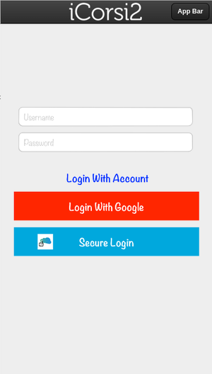
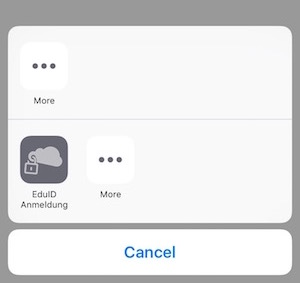
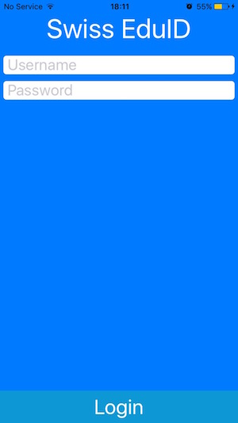
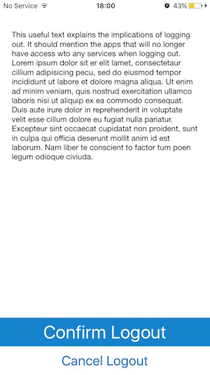

# User Experience

## Introduction

This part of the architecture describes the core user experience of the Swiss edu-ID Mobile App.

The Swiss eduID Mobile App has two core interaction modes:

* edu-ID Mode
* Authorization Mode

## Core User Experience

The core user experience is the Authorization Mode. The Authorization Mode is active if a third party app requests authorization for a service within the eduID Federation.

The Authorization Mode is split into three parts.

1. The Third Party User Experiences
1. The Operating System Experiences
1. The eduID Mobile App Experiences

For the three phases of the user experience it is necessary to understand that the *only* those experiences related to the eduID Mobile App are actually controllable.

For illustration purposes the authentication scheme for the eduID is called "App OAuth". This indicates that other federations may use the same scheme (as opposed to the system internal schemes for large commercial IDPs).

The common workflow from the user experience is:

1. The active app indicates that it requires access to an external service. The related user interface displays the possible options for authorization. (e.g. Password, Google, Facebook, App OAuth). The user experience for the authorization request is completely under control of the third party app maintainer.

2. The mobile operating system selects an appropriate app (on Android the edu-ID app is selected automatically so, for now, this step is valid only for iOS). Operating system uses it standard inter-app communication interfaces to allow the users to channel the request into the Swiss edu-ID Mobile App. On iOS the operating system launches an "App Selector"/"Sharing Menu" that allow users to select the appropriate authentication app. These pop-up menus are commonly used user interface elements.

3. The edu-ID Mobile App indicates to the user, what information has been requested and which services within the federation are capable of serving the requested data. This is done my presenting a list of services to the users.

4. The users can select one or more services to be authorized for the third party app. In case the app can handle only 1 authorization the users must select exactly 1 service. If no services were selected, all services are granted.

5. The users return to the third party app by accepting or rejecting the authorization request.

6. The third party app continues with its authorized interaction experiences.

It is important to recall that the eduID Mobile App can only control the steps 3-5 of the user experiences. The other elements of the user experience are integrated into the third party app's user experience or embedded into the operating system. In both cases the familiarity of the users can be safely assumed.

## Utility Experiences

In edu-ID Mode the app provides access to utility functions. These include:

* Authentication with the eduID Service
* Profile View
* Unlinking the App from an Account

### Authentication with the eduID Service

The eduID Mobile App is persistently authorized with the eduID Service once the users authenticate. As long the eduID Mobile App is not authenticated for a user the edu-ID Mobile App will display a login screen.

If a user selected the app authorization from a third party app without being authorized in the edu-ID Mobile App, step 3 of the core user experience will be preceded by edu-ID Authorization (by displaying the Login Screen).

### Profile View

If users start the edu-ID Mobile App in edu-ID Mode and the app is authorized for a user, then the app will start into the profile view. This is the primary interface for reviewing the personal data.

In a future iteration the profile view may provide interfaces to other persistent information such as account management functions, the list of authorized apps, or the list of used services. Presently, the only auxiliary function is the logout.

### Unlinking the App from an Account

If users decide to unlink the eduID Mobile they can do so by using the "logout" button in the profile view. Before a user actually unlinks the app, a warning is presented in order to inform the users that logging out means also that all app authorizations will be rejected. At this point the users can stop unlinking the eduID Mobile App and return to the profile view.

If the users confirm to logout, the all will return to the Login screen.

After logging out in the edu-ID Mobile App, the third party apps that were previously authorized will receive an error if they try to access the academic services. In this case third party apps should inform the users that a previous authorization has been invalidated and allow the users to reestablish the connection.
